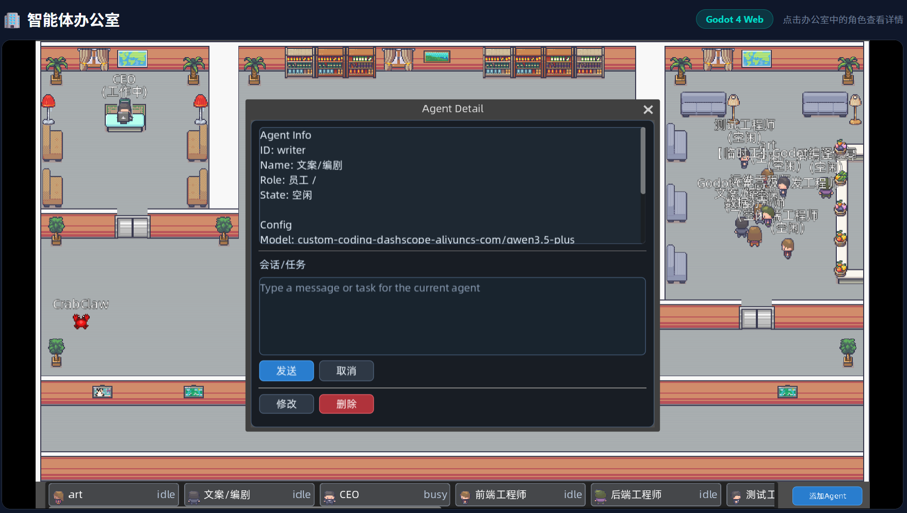

# AICube Agent Office

基于 Godot 4.x 构建的 2D 像素风办公室模拟，Agent 以角色形象实时呈现在界面上。支持通过 OpenClaw Agent API 同步多个 Agent 的工作状态。

[English](README_EN.md)

## 截图展示




## 功能特点

- 🏢 **老板间**：老板办公桌、电脑、书架、挂画、落地窗、棋盘格地毯
- 👥 **员工区**：5 个工位（桌、椅、电脑）、窗户、绿植
- ☕ **休息区**：沙发休息区、茶水间（咖啡机、茶壶）、聊天角
- 🤖 **Agent 系统**：
  - 5 个像素风 Agent，各有名称、职位、状态图标
  - 🟢工作中 🟠休息中 🔵移动中 ⚪空闲 四种状态
  - 行走动画带浮动效果
  - 点击查看详情面板

## 项目结构

```
godot-office/
├── project.godot          # Godot 项目配置
├── export_presets.cfg     # HTML5 导出配置
├── icon.svg               # 项目图标
├── scenes/
│   ├── office.tscn        # 主办公室场景
│   └── agent.tscn         # Agent 角色场景
├── scripts/
│   ├── office.gd          # 办公室逻辑、Agent 管理
│   └── agent.gd           # Agent 行为、移动、状态切换
└── export/
    └── index.html         # （导出后生成）
```

## 快速开始

### 方式一：Godot 编辑器
1. 从 https://godotengine.org 下载 Godot 4.x
2. 用 Godot 打开本项目文件夹
3. 按 F5 运行

### 方式二：导出 HTML5
1. 在 Godot 编辑器中打开项目
2. 进入 **Project > Export**
3. 选择 **Web** 预设
4. 点击 **Export Project**
5. 文件将生成在 `export/` 文件夹

### HTML5 本地测试
导出的 Web 版本需要通过 HTTP 服务器访问（SharedArrayBuffer CORS 限制）：
```bash
cd export
python3 -m http.server 8080
# 或
npx serve .
```
然后打开 http://localhost:8080

## 操作说明

- **点击 Agent**：打开详情面板
- **切换状态**：在工作/休息状态间切换
- **点击空白处**：关闭面板

## Agent 角色

| 名称   | 职位       | 颜色   |
|--------|-----------|--------|
| Alice  | 前端工程师  | 🔵 蓝  |
| Bob    | 后端工程师  | 🩷 粉  |
| Charlie| 设计师     | 🟢 绿  |
| Diana  | 测试工程师  | 🟠 橙  |
| Eve    | 运维工程师  | 🟣 紫  |

## 状态说明

- 🟢 **工作中**：在工位上
- 🟠 **休息中**：在休息区
- 🔵 **移动中**：在不同区域间移动
- ⚪ **空闲**：等待中

## API 接口

项目通过 OpenClaw Agent API 获取 Agent 状态信息。API 地址可在 `scripts/office.gd` 中配置：

```gdscript
@export var api_base_url: String = "/api"
@export var api_fallback_base_urls: PackedStringArray = [
    "http://localhost:5180/api",
    "http://127.0.0.1:5180/api"
]
```

> ⚠️ 部署时请根据实际环境修改 `api_fallback_base_urls`。

## 技术栈

- **引擎**：Godot 4.x
- **语言**：GDScript
- **渲染**：2D 像素风（Godot TileMap + Sprite2D）
- **导出**：HTML5（Web）

---

*Built with Godot 4.x*
